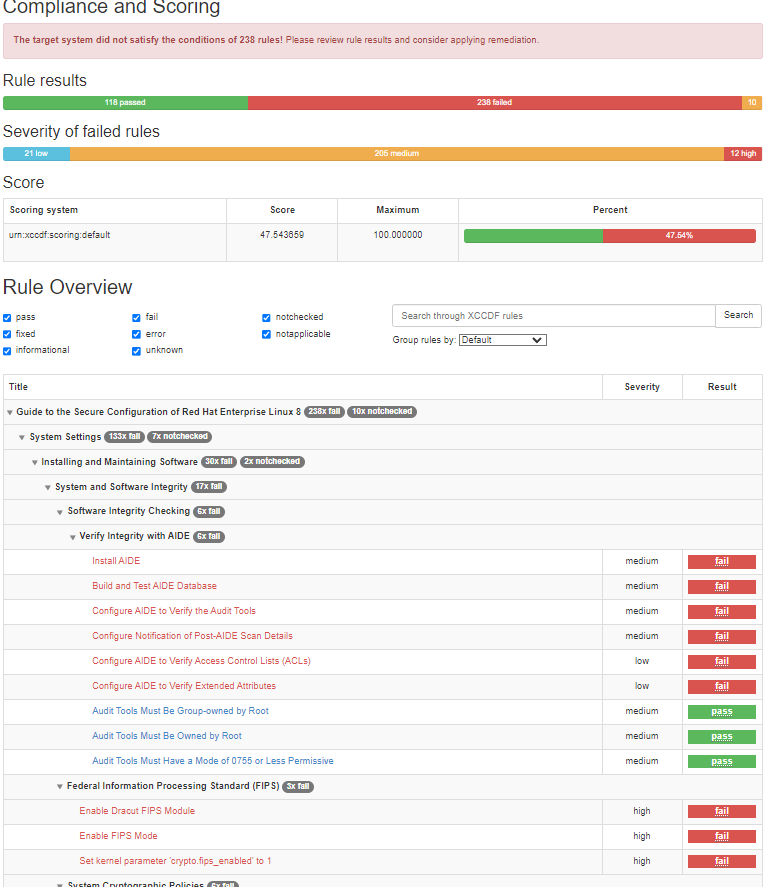
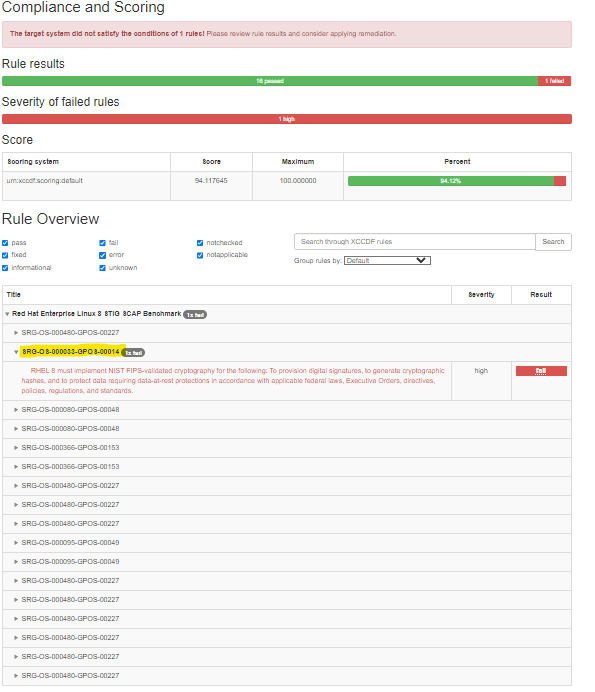

# SCAP on RHEL Practice

<aside>
💡

This is my first time stigging linux based machines using SCAP and Stigviewer. Most of my experience is in Windows based environments using Nessus. My goal for this practice is to have 100% Compliance on CAT I vulnerabilities. All Downloads for SCAP and Stig Viewer can be found Below.

</aside>

<aside>
💡

[SCAP tool](https://public.cyber.mil/stigs/scap/)

[Stig Viewer](https://public.cyber.mil/stigs/stig-viewing-tools/)

[DISA Stig Profiles](https://github.com/ComplianceAsCode/content/releases)

</aside>

### Step 1: Install SCAP Security Guide and OpenSCAP

1. **Connect to each VM (Master and Worker)**:
    
    ```bash
    ssh username@<vm_ip>
    ```
    
2. **Install OpenSCAP and SCAP Security Guide**:
    
    ```bash
    sudo dnf install -y openscap-scanner scap-security-guide
    ```
    

### Step 2: Locate the STIG Profile for RHEL 8

1. List available profiles to confirm the presence of the STIG profile:
    
    ```bash
    oscap info /usr/share/xml/scap/ssg/content/ssg-rhel8-ds.xml
    ```
    
2. Look for `stig` profiles, typically named `xccdf_org.ssgproject.content_profile_stig`.

### Step 3: Run the SCAP Scan for STIG Compliance

1. Run the following command to perform a scan and generate an HTML report:
    
    ```bash
    sudo oscap xccdf eval --profile stig --report /tmp/scap-report.html /usr/share/xml/scap/ssg/content/ssg-rhel8-ds.xml
    ```
    
    - The `-profile stig` option applies the STIG-specific controls.
    - The report will be saved as `/tmp/scap-report.html`.

### Step 4: Review the SCAP Report

1. Transfer the report from the VM to your local machine for easy viewing:
    
    ```bash
    scp root@192.168.1.200:/tmp/scap-report.html ~/rke2-project/scap
    
    ```
    
2. Open the `scap-report.html` file in a web browser. It will list the controls that passed, failed, or require manual verification.

<aside>
💡

I realize after reviewing the report, we didnt use any type of Stig Profile. We can tailor to evaluation to only look for [CAT I only](https://github.com/ComplianceAsCode/content/blob/master/shared/references/disa-stig-rhel8-v2r1-xccdf-scap.xml) vulns using a profile from DISA.

</aside>



## Upload Customize STIG Profile

Open WinSCP and copy | paste the `disa-stig-rhel8-v2r1-xccdf-scap.xml` to a known directory.

I pasted it to `/root/rke2-project/scap/CAT I's Only/`


## Dry-Run

**Run Without Explicit Datastream and XCCDF IDs**:

- If you’re unsure about the IDs, you can omit `-datastream-id` and `-xccdf-id` to allow OpenSCAP to use the defaults, assuming the SCAP file only contains one benchmark and profile.

```bash
oscap-ssh 192.168.1.201 22 xccdf eval --fetch-remote-resources --profile xccdf_mil.disa.stig_profile_CAT_I_Only --oval-results --results /tmp/xccdf-results.xml --results-arf /tmp/arf.xml --report /tmp/report.html "/root/rke2-project/scap/CAT I's Only/disa-stig-rhel8-v2r1-xcc

```

## Remediate

If you want to automatically remediate applicable findings, you can add the `--remediate` flag to your `oscap-ssh` command. Here’s how the command would look with remediation enabled:

```bash
oscap-ssh 192.168.1.201 22 xccdf eval --fetch-remote-resources --profile xccdf_mil.disa.stig_profile_CAT_I_Only --oval-results --results /tmp/xccdf-results.xml --results-arf /tmp/arf.xml --report /tmp/report.html --remediate "/root/rke2-project/scap/CAT I's Only/disa-stig-rhel8-v2r1-xccdf-scap.xml"

```

Master SCAP Eval

```bash
oscap-ssh 192.168.1.201 22 xccdf eval --fetch-remote-resources --profile xccdf_mil.disa.stig_profile_CAT_I_Only --oval-results --results /tmp/xccdf-results.xml --results-arf /tmp/arf.xml --report /tmp/Master-report.html "/root/rke2-project/scap/CAT I's Only/disa-stig-rhel8-v2r1-xccdf-scap.xml"

```

Worker SCAP Eval

```bash
oscap-ssh 192.168.1.201 22 xccdf eval --fetch-remote-resources --profile xccdf_mil.disa.stig_profile_CAT_I_Only --oval-results --results /tmp/xccdf-results.xml --results-arf /tmp/arf.xml --report /tmp/Worker-report.html "/root/rke2-project/scap/CAT I's Only/disa-stig-rhel8-v2r1-xccdf-scap.xml"

```

<aside>
💡

Ive ran the remediation and the result is 70% compliant! That makes it easier than hand jamming the numerous settings thats needed. Now we can focus on the ones that need more attention. 

</aside>


### Steps to Enable FIPS Mode on RHEL 8

1. **Enable FIPS Mode**:
    
    Run the following command to enable FIPS mode:
    
    ```bash
    sudo fips-mode-setup --enable
    ```
    
2. **Reboot the System**:
    
    After enabling FIPS mode, reboot the system for the changes to take effect:
    
    ```bash
    sudo reboot
    ```
    
3. **Verify FIPS Mode**:
    
    After the system restarts, check if FIPS mode is enabled by running:
    
    ```bash
    cat /proc/sys/crypto/fips_enabled
    ```
    
    - If FIPS mode is active, the output will be `1`.
    - If the output is `0`, FIPS mode is not enabled, and you may need to troubleshoot.
4. **Verify Kernel Parameter (`fips=1`)**:
    
    FIPS mode requires the `fips=1` kernel parameter to be set. After enabling FIPS mode, you should find this parameter in your bootloader configuration.
    
    You can check by running:
    
    ```bash
    sudo cat /boot/grub2/grubenv | grep fips
    ```
    
5. **Add `fips=1` Manually (If Necessary)**:
    
    If FIPS mode is not active and the `fips=1` parameter is missing, you can manually add it to the kernel command line:
    
    - Edit the GRUB configuration file:
        
        ```bash
        udo vi /etc/default/grub
        ```
        
    - Add `fips=1` to the `GRUB_CMDLINE_LINUX` line, for example:
        
        ```bash
        GRUB_CMDLINE_LINUX="... fips=1"
        ```
        
    - Save and close the file.
    - Update the GRUB configuration to apply changes:
        
        ```bash
        sudo grub2-mkconfig -o /boot/grub2/grub.cfg
        ```
        
    - Reboot the system to apply the changes.
6. **Optional: Ensure FIPS-Compliant Cryptographic Algorithms in Applications**:
    - Certain applications might require specific configurations to use FIPS-approved cryptographic modules. For instance, if you are using OpenSSL, it should be FIPS-compliant when FIPS mode is enabled.
    - Some applications might need additional configurations to comply with FIPS requirements, depending on your organization’s security policies.

### Summary

1. Run `sudo fips-mode-setup --enable`.
2. Reboot the system.
3. Verify FIPS mode by checking `/proc/sys/crypto/fips_enabled`.
4. If needed, add `fips=1` to the kernel command line in `/etc/default/grub`, update GRUB, and reboot.

After completing these steps, re-run the OpenSCAP scan to confirm compliance. Let me know if you encounter any issues!

### Step 1: Verify the Current Password Hashing Algorithm

1. Check the current password hashing algorithm by running:You should see output like `password hashing algorithm is sha512` if SHA-512 is already in use.
    
    ```bash
    authconfig --test | grep hashing
    ```
    

### Step 2: Configure SHA-512 for Password Hashing

If SHA-512 is not already enabled, follow these steps to configure it:

1. **Use `authconfig` to Set SHA-512**:
    
    Run the following command to set SHA-512 as the password hashing algorithm:
    
    ```bash
    sudo authconfig --passalgo=sha512 --update
    ```
    
    - **`-passalgo=sha512`**: This option sets the password hashing algorithm to SHA-512.
    - **`-update`**: This applies the change to the system configuration.
2. **Verify the Change**:
    
    Run the command from Step 1 again to verify that SHA-512 is now set:
    
    ```bash
    authconfig --test | grep hashing
    ```
    

### Step 3: Update `/etc/login.defs` (Optional but Recommended)

To ensure that SHA-512 is consistently used across all system utilities, you can add or update the following line in `/etc/login.defs`:

1. Open the file in a text editor:
    
    ```bash
    sudo vi /etc/login.defs
    ```
    
2. Ensure the following line is present:
    
    ```bash
    ENCRYPT_METHOD SHA512
    ```
    
3. Save and close the file.

### Step 4: Set a New Password to Apply SHA-512 Hashing

Changing a password will trigger the new hashing algorithm. You can test this by setting a new password for a user:

```bash
sudo passwd <username>
```

Replace `<username>` with the actual username. After updating the password, the new hash will be generated using SHA-512.

### Step 5: Verify the Password Hash

1. Check the `/etc/shadow` file to verify the password hash for the user you updated:
    
    ```bash
    sudo cat /etc/shadow | grep <username>
    ```
    
2. SHA-512 hashes are prefixed with `$6$`. If the password is hashed with SHA-512, you’ll see something like `$6$...` in the output for that user.

I did have some trouble with the last vuln requiring us to install FIPs. I do have evidence that FIPs did install. 

<aside>
💡

Looking at what OVAL test results detail’s, this will give us an Idea of what Parameters SCAP is using to determine if a vulnerability is complaint. In order for this vuln to be consider resolve, `/proc/sys/crypto/fips_enabled` has to return `1` . In my case it returned a `0` . Also the `/boot/grub2/grubenv`  has to return with a pattern of `^\s*kernelopts=[^#]*fips=(\d+)\b`  with an output of `1` .

</aside>


<aside>
💡

Apon further investigation, even though this is what SCAP output, I can confirm that FIPs is installed. Note: At this point I’m confident that FIPs is installed BUT that’s no reason for me to be the only one to say this is compliant. At this point I would consult with associates and my Lead before deeming this completely remediated. The best I can do is to leave this vuln open and present with my evidence that I have and wait for further instruction.

</aside>


<aside>
💡

Besides FIPS we are compliant with CAT I Vulnerabilities!

</aside>

